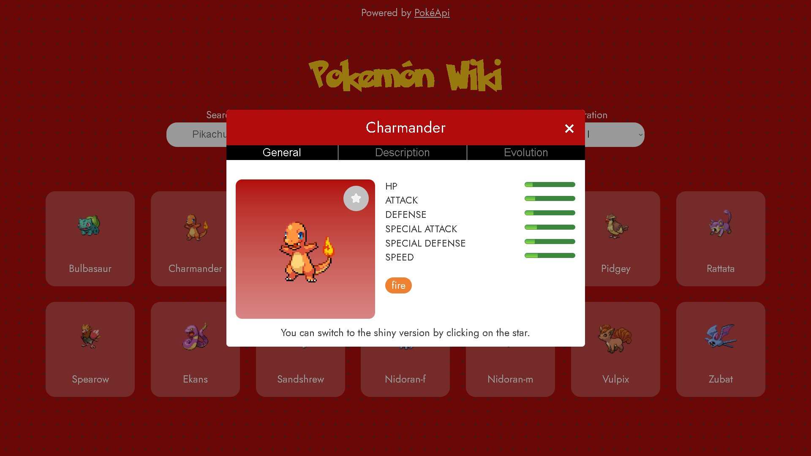
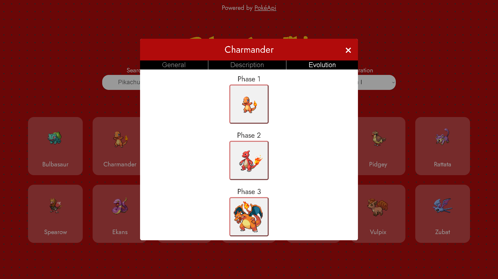

#  Pokémon Wiki

A web application to explore all Pokémon by generation. You can search for specific Pokémon within a generation and view detailed information about each one.


## Demo

[Pokemon Wiki Live Demo](https://pokemon-wiki-mauve.vercel.app)


## Screenshots






## Features

- Browse all Pokémon by generation
- Search for specific Pokémon within a generation.
- View detailed information about each Pokémon, including stats, types, descriptions, and evolution tree.


## Tech Stack

### Frontend

- **React**: For building the user interface.
- **Vite**: As the development server and build tool for fast and optimized performance.
- **pnpm**: For package management, ensuring efficient dependency handling.
- **react-intersection-observer**: A library for handling image loading by observing when elements enter or exit the viewport.

### Backend 

- **PokemonApi**: This open-source API allowed me to consume all the information related to a Pokémon.

## Optimizations

I use the react-intersection-observer library to improve performance when loading images.


## Installation

Install my-project with pnpm

- **Clone the repository(with SSH)**:    
   ```bash
   git clone git@github.com:SK-ClaudioBustos/pokemon-wiki.git
- **Go into the folder**: 
   ```bash
   cd pokemon-wiki
- **Install dependencies:**:
   ```bash
   pnpm install
- **Run the development server:**:
   ```bash
   pnpm run dev
    